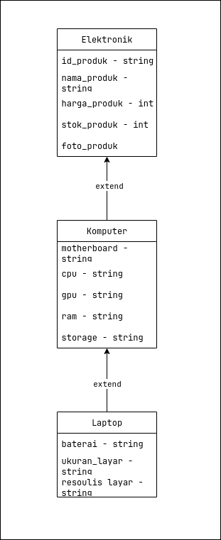

# TP2DPBO2425C1

Repositori ini berisi implementasi program berbasis Object-Oriented Programming (OOP) untuk Tugas Praktikum 2 mata kuliah Desain dan Pemrograman Berorientasi Objek.

## Janji
Saya Zharfan Faza Wibawa dengan NIM 2403995 mengerjakan Tugas Praktikum 2 dalam mata kuliah Desain dan Pemrograman Berorientasi Objek untuk keberkahanNya maka saya tidak melakukan kecurangan seperti yang telah dispesifikasikan. Aamiin.

## 🚀 Deskripsi Proyek

Program ini adalah simulasi sederhana manajemen data produk di sebuah toko elektronik. Fokus utama dari proyek ini adalah untuk mendemonstrasikan konsep **Pewarisan Multi-Level (*Multi-Level Inheritance*)** menggunakan struktur tiga tingkat kelas.

Implementasi program tersedia dalam empat bahasa pemrograman yang berbeda:
- C++
- Java
- Python
- PHP

## 🏛️ Desain & Struktur Kelas

Struktur pewarisan kelas yang digunakan adalah sebagai berikut:

