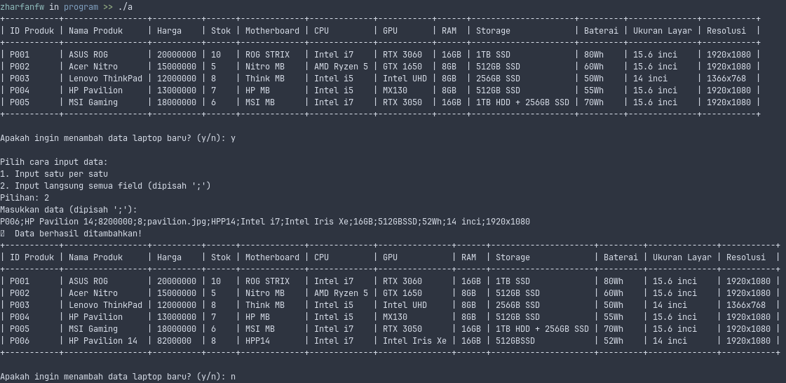
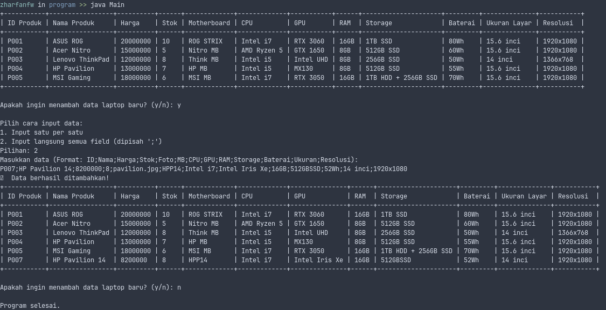
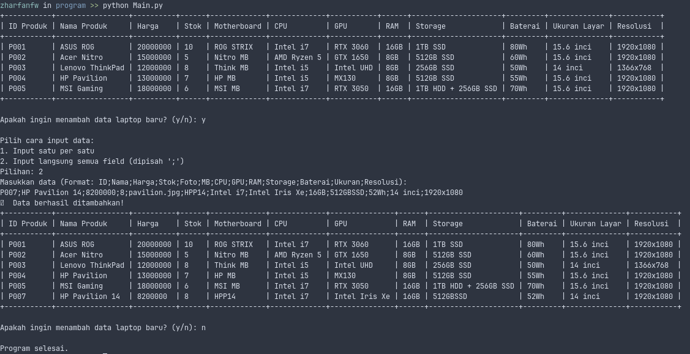
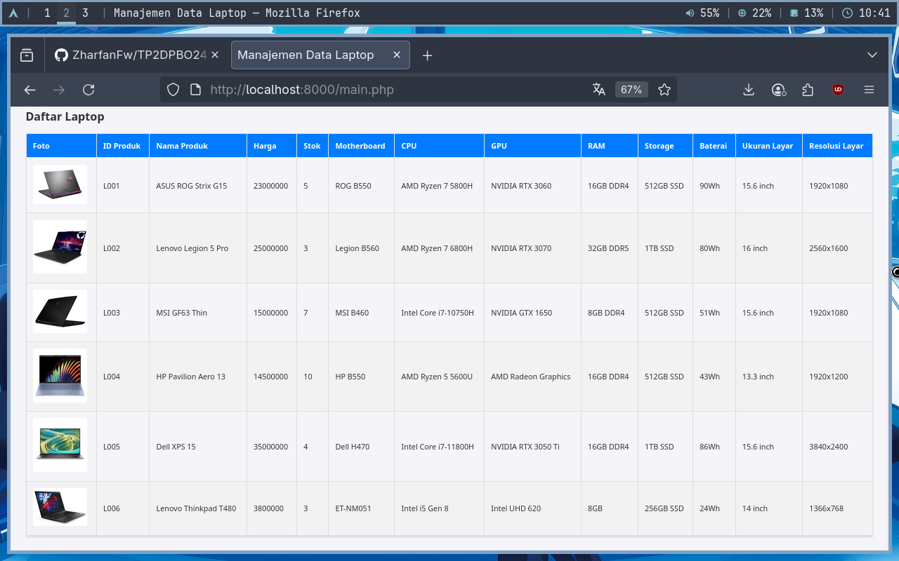

# TP2DPBO2425C1

Repositori ini berisi implementasi program berbasis Object-Oriented Programming (OOP) untuk Tugas Praktikum 2 mata kuliah Desain dan Pemrograman Berorientasi Objek.

## Janji
Saya Zharfan Faza Wibawa dengan NIM 2403995 mengerjakan Tugas Praktikum 2 dalam mata kuliah Desain dan Pemrograman Berorientasi Objek untuk keberkahanNya maka saya tidak melakukan kecurangan seperti yang telah dispesifikasikan. Aamiin.

## 🚀 Deskripsi Proyek

Program ini adalah simulasi sederhana manajemen data produk di sebuah toko elektronik. Fokus utama dari proyek ini adalah untuk mendemonstrasikan konsep **Pewarisan Multi-Level (*Multi-Level Inheritance*)** menggunakan struktur tiga tingkat kelas.

Implementasi program tersedia dalam empat bahasa pemrograman yang berbeda:
- C++
- Java
- Python
- PHP

## 🏛️ Desain & Struktur Kelas

Struktur pewarisan kelas yang digunakan adalah sebagai berikut:
 

 

### **1. Elektronik (Base Class)**
- `id` (string): ID produk
- `nama_produk` (string): Nama produk
- `harga_produk` (int): Harga produk
- `stok_produk` (int): Jumlah stok produk
- `foto_produk` (string): URL gambar produk

### **2. Komputer (Child of Elektronik)**
- `motherboard` (string): motherboard
- `cpu` (string): cpu
- `gpu` (string): gpu
- `ram` (string): ram
- `storage` (string): storage

### **3. Laptop (Child of Komputer)**
- `baterai` (string): Baterai
- `ukuran_layar` (string): Ukuran layar laptop
- `resolusi_layar` (string): Resolusi layar laptop

## Alur Program
1.  **Inisialisasi Data Awal**: Saat program pertama kali berjalan, ia akan secara otomatis memuat serangkaian data **Laptop** yang telah ditentukan sebelumnya sebagai contoh awal.
2.  **Tampilan Pertama**: Data awal tersebut akan segera ditampilkan kepada pengguna dalam format tabel yang rapi dan terstruktur.
3.  **Interaksi Pengguna**: Program kemudian akan memberikan opsi kepada pengguna untuk menambahkan data elektronik baru.
4.  **Proses Input & Validasi**: Jika pengguna memilih untuk menambah data, program akan meminta input. Setiap data yang dimasukkan akan divalidasi untuk memastikan kelengkapan dan keunikannya (misalnya, ID tidak boleh sama).
5.  **Pembaruan Daftar**: Data baru yang berhasil lolos validasi akan disimpan, dan program akan menampilkan kembali seluruh isi daftar dalam tabel yang sudah diperbarui secara dinamis.
6.  **Pengulangan**: Proses dari langkah 3 hingga 5 akan terus berulang, memungkinkan pengguna untuk menambahkan data secara berkelanjutan.
7.  **Terminasi**: Program akan berakhir ketika pengguna memutuskan untuk tidak lagi menambahkan data.

## 📷 Dokumentasi
1. **CPP**
 

 

 

 

<br
